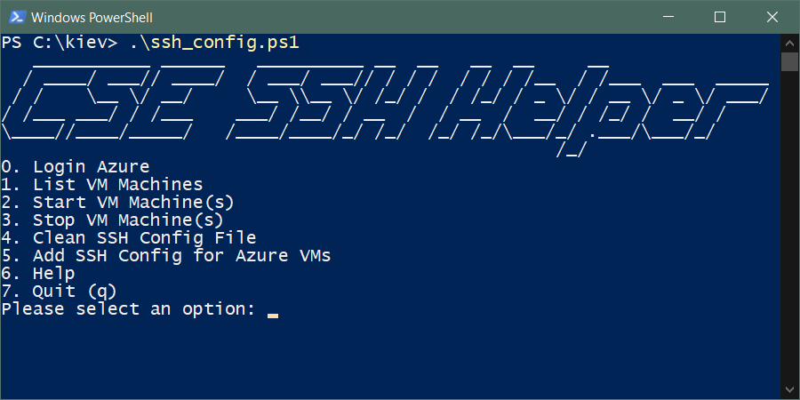
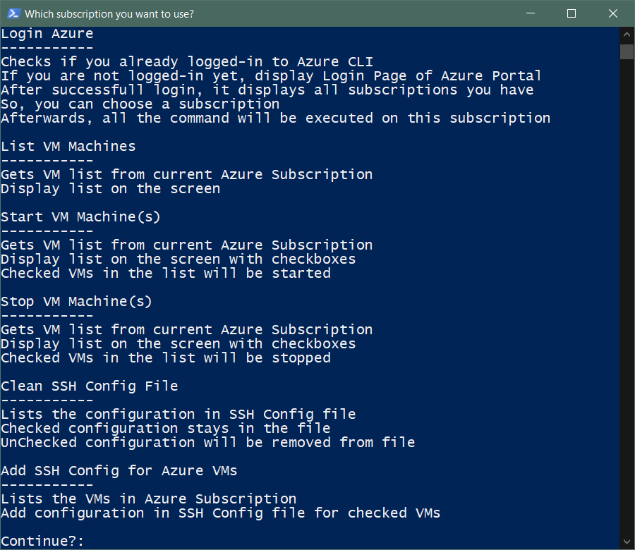

# SSH Configuration Helper

In projects, we usually need to open _SSH connections_ to remote systems.

For example, we can open an _SSH connection_ to a _remote machine_ from within the [Visual Studio Code](https://code.visualstudio.com) (you need to have [Remote Development](https://marketplace.visualstudio.com/items?itemName=ms-vscode-remote.vscode-remote-extensionpack) extension pack) and develop the project inside of the remote machine.

This scenario allows us to have a _thin machine_, but still, develop the project with a much more powerful machine with lots of _RAM_, _CPU_ and even _GPU_ resources on [Azure](https://azure.microsoft.com).

But to do that, we need to edit [SSH Configuration file](https://www.ssh.com/ssh/config/)

We can find [SSH Configuration file](https://www.ssh.com/ssh/config/) in _~/.ssh/config_ or _C:\Users\\{USER}\\.ssh\config_ path

## Configuration Helper

You can use [Configuration Helper](./ssh_config.ps1) _PowerShell Script_ to make it easier to edit [SSH Configuration file](https://www.ssh.com/ssh/config/)

### Menu

Reference: [ssh_config.ps1#L40](./ssh_config.ps1#L40)

You can choose 1 of the following Menu Items

* [Login Azure](#login-to-azure)
* [List VM Machines](#list-vm-machines)
* [Start VM Machine(s)](#start-vm-machines)
* [Stop VM Machine(s)](#stop-vm-machines)
* [Clean SSH Config File](#clean-ssh-configuration-file)
* [Add SSH Config for Azure VMs](#add-ssh-config-for-azure-vms)
* [Help](#help)
* [Quit](./ssh_config.ps1#L71)

### Login to Azure

Reference: [ssh_config.ps1#L77](./ssh_config.ps1#L77)

You can login to [Azure Portal](https://portal.azure.com) via [Azure CLI](https://docs.microsoft.com/en-us/cli/azure/get-started-with-azure-cli) to access to the _VMs_ running on [Azure](https://portal.azure.com).

It's checking if the user is already logged-in to the [Azure Portal](https://portal.azure.com), if not, it launches a new browser page to login to the [Azure Portal](https://portal.azure.com).

If only 1 subscription is available for the user, it selects that subscription, if there is more than 1 subscription, it asks the user to choose one of them, and, it sets that subscription as _Default_.

So, all the upcoming commands will be executed on selected subscription, such as, getting the list of VMs, etc.

### List VM Machines

Reference: [ssh_config.ps1#L108](./ssh_config.ps1#L108)

It's getting all the _VMs_ on _Azure Subscription_ and list them with _Names_ and _Power States_

### Start VM Machine(s)

Reference: [ssh_config.ps1#L120](./ssh_config.ps1#L120)

It's getting all the _VMs_ on _Azure Subscription_, list them with checkboxes, selected VMs will be started

### Stop VM Machine(s)

Reference: [ssh_config.ps1#L133](./ssh_config.ps1#L133)

It's getting all the _VMs_ on _Azure Subscription_, list them with checkboxes, selected VMs will be stopped

### Clean SSH Configuration File

Reference: [ssh_config.ps1#L146](./ssh_config.ps1#L146)

It parse the [SSH Configuration file](https://www.ssh.com/ssh/config/) and creates a [ConfigItem](ssh_config.ps1#L3) array.

Lists [ConfigItem](ssh_config.ps1#L3) array with checkboxes, selected [ConfigItem](ssh_config.ps1#L3)s will be preserved, others will be removed from the [SSH Configuration file](https://www.ssh.com/ssh/config/)

### Add SSH Config for Azure VMs

Reference: [ssh_config.ps1#L232](./ssh_config.ps1#L232)

It gets all the _VMs_ on the _Azure Subscription_, lists them with checkboxes, for the selected VMs a new [ConfigItem](ssh_config.ps1#L3) element will be created.

All the [ConfigItem](ssh_config.ps1#L3)s will be appended to the [SSH Configuration file](https://www.ssh.com/ssh/config/)

### Help

Reference: [ssh_config.ps1#L281](./ssh_config.ps1#L281)

## References

[Write-Menu](https://github.com/QuietusPlus/Write-Menu) function for _PowerShell_ (created by [QuietusPlus](https://github.com/QuietusPlus)) helped a-lot during the development of this script.